# Aula 04: Modelos Cinemáticos - Abordagem diferencial

## Introdução

Robô tem duas rodas independentes.
Todos os objetos em cena possuem seus respectivos frames.

O robô é composto de várias partes e essas partes também podem ter seus próprios frames.

Por isso, toda cena terá um frame inercial (frame parado de referência).

Em robótica terrestre, o convencional é que o eixo x seja a frente e o eixo z aponte para cima. Nas aulas adotaremos o padrão convencional:

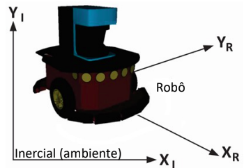

O robô terá o seu próprio referencial, porém a posição espacial do robô (P) no mundo bidimensional será um vetor que conta com as suas coordenadas:

$$
P =
\begin{bmatrix}
x\\
y\\
\end{bmatrix}
$$

É necessário dizer a orientação do robô no mundo, acrescentando em P o angulo $\theta$ de orientação, logo $P = [x, y, \theta]^{T}$

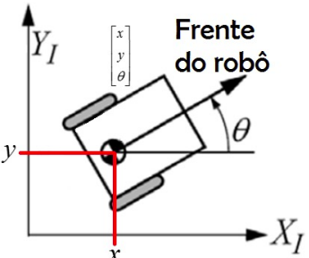

## Quais variáveis temos?

Temos as velocidades de rotação das duas rodas. E sabemos as dimensões físicas do robô.

Sendo $r $ o raio da roda do robô, w a velocidade angular temos que a velocidade linear é:

$ v = r\*w$

Cada uma das duas rodas contribui com _metade_ da velocidade linear do ponto médio, já que este ncontra-se na exata metade do caminho.Logo, a soma das duas contribuições é:

$v= \frac{r}{2}*(\omega{r}+\omega{l})$ , sendo r de right e l de left

## Velocidades de modo geral

De modo geral, sendo r o raio da roda e l a distância da roda até o ponto médio do robô temos que:

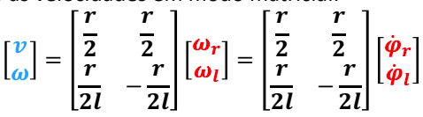

e inversamente:

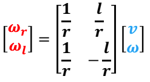

## Modelo cinemático no frame global

Tendo as relações de velocidade,obtemos:

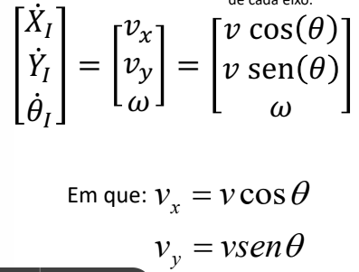

Reescrevendo, temos:

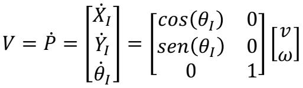

Podemos então obter a posição pela integração numérica da velocidade.

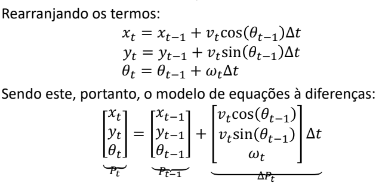

# Abordagem incremental

Seja um robô se movendo sob um circulo, temos o seguinte:

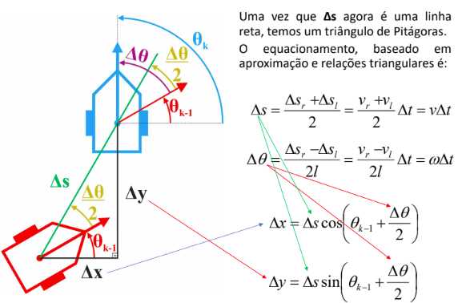

Assim, basicamente calculamos o deslocamento a partir do theta do instante anterior mais a variação entre os theta dividido por 2.

Então, temos:

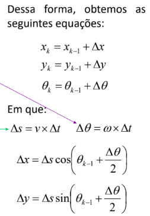

Em formato matricial:

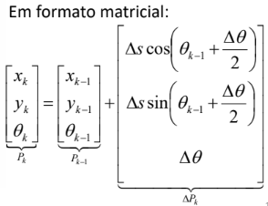

Para o caso de obtermos o $\Delta{S}$ das duas rodas de forma distinta,onde r é right e l é left:

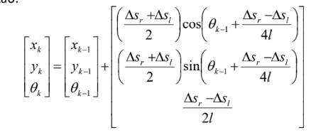

ou em velocidades lineares:

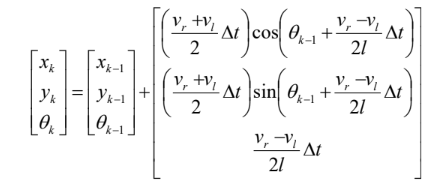
