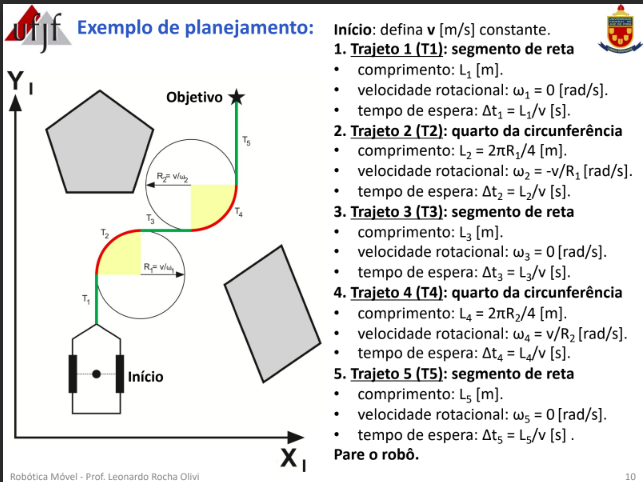
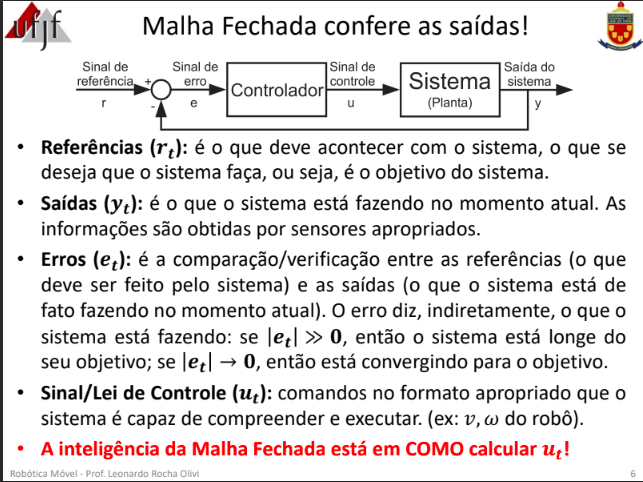
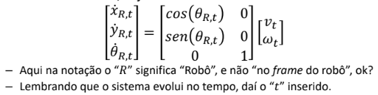
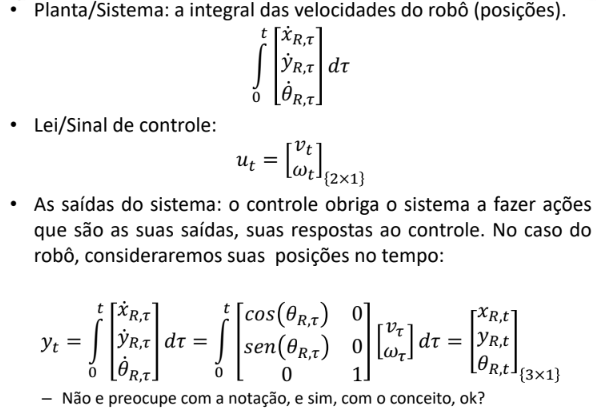
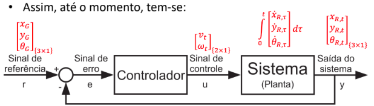
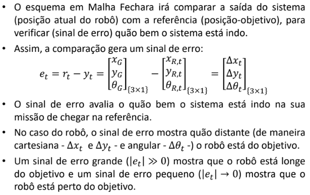
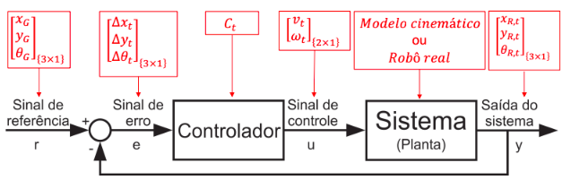
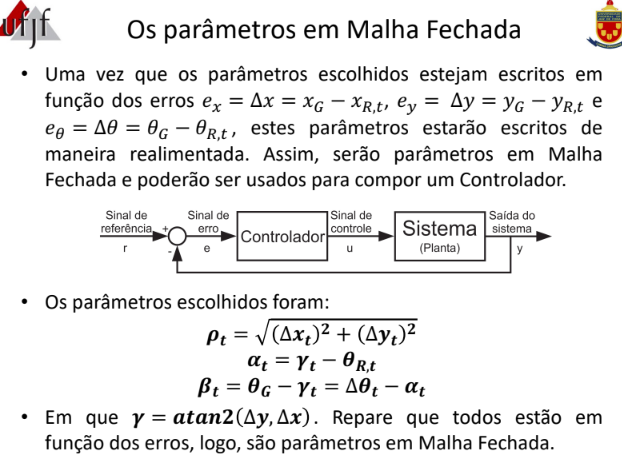
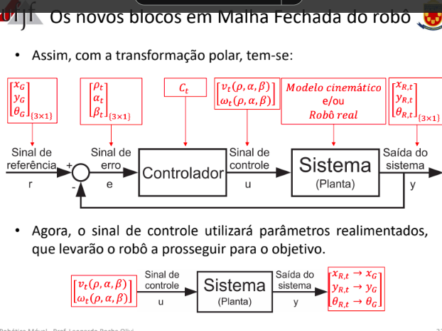

# Controle em Malha Aberta

Normalmente divide-se a trajetória em vários trechos simples, como segmentos de retas e círculos.

Dada uma velocidade linear fixa v, escolhida pelo usuário para um trecho, a navegação se baseará no tempo (delta t) em que o robô seguirá em cada um destes segmentos de comprimento (L).

No caso anterior não haverá realimentação da posição do robô, ou seja, confia-se que o robô executará o plano desenvolvido previamente sem quaisquer problemas.

Desta forma, a estratégia depende do exato funcionamento de sensores e atuadores, que não são perfeitos.

Basicamente, em malha aberta dividimos o trajeto em varios trajetos menores para o algoritmo percorrer.

Exemplo:

***Ver o código para simulação no slide 11 da disciplina***

# Controle em Malha Fechada

Em malha aberta, o sistema a ser controlado é o modelo cinemático, seja o diferencial ou incremental. Então:

Planta/Sistema: a integral das velocidades do robô (posição)

Após análises:

