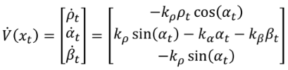
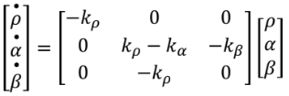
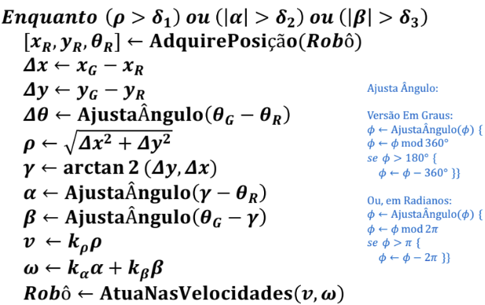
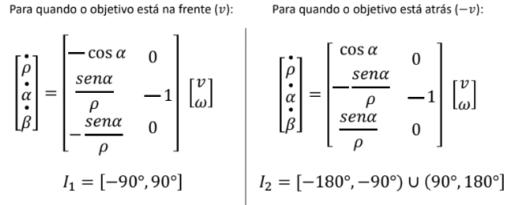
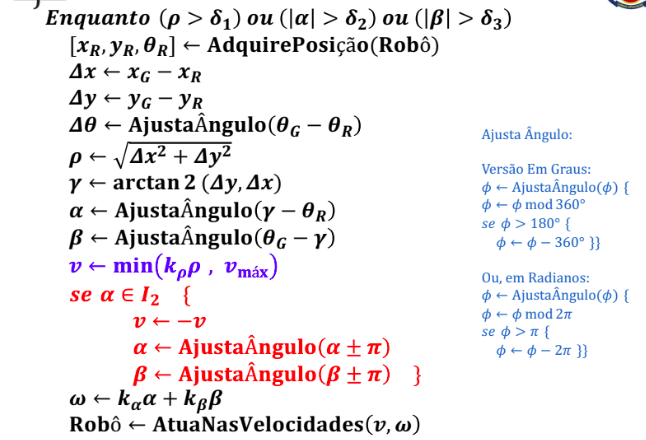
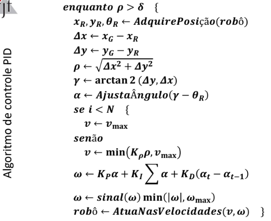
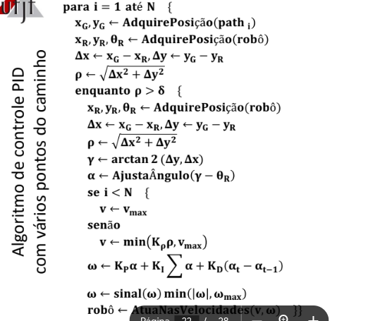

# Controle Proporcional

## Análise inicial

Conforme visto, temos que o sistema do robô em malha fechada foram calculadas como:



Sistemas n-lineares são de difícil análise de estabilidade global de todos os pontos de equilíbrio.

Usamos a série de taylor para linearizar e poder analisar.

Fazendo todo o processo da linearização na origem, temos:



O sistema resultante é um sistema linear e invariante no tempo, pois depende apenas de constantes.

A solução desse sistema pode ser utilizada para analisar as redondezas do sistema não-linear

Para definir a estabilidade, é necessário que os autovalores tenham parte real negativa para que a solução seja estável

Fazeno a análise dos autovalores, chegamos na conclusão das 3 constantes:
- Kro > 0
- Kalpha > Kro
- Kbeta < 0

Precisamos manter alpha e beta sempre no intervalo [-180°, 180°]. Para isso utilizamos da função de ajuste dos ângulos (vale o mesmo para em rad, so trocar 360 por 2pi)

```python
def AjustaAngulo(phi):
    phi = phi % 360
    if(phi > 180):
        phi = phi - 360
    return phi
```
Logo, temos o algoritmo de controle proporcional:



## Problemasda estratégia adotada

- Quando ro é muito grande, v também fica grande, o que pode ser infactível para o robô. É necessário então introduzir uma vmax para o robô
- A lei de controle de v tem o reflexo que v >= 0 sempre, o que não é verdade pois o robô deve poder virar ou andar para trás.
    - Fica conveniente dividir a nevagação em duas fases
    - Desta forma, o robô não precisa manobrar para se orientar em direção ao ponto objetivo, ele pode ir de ré
    - Logo temos dois modelos para o robô diferencial
    

Logo, o algoritmo final com os ajustes para os problemas fica:



# Controle PID

Para levar em consideração obstáculos e podermos desviar, iremos subdividir o objetivo final em um caminho com vários subobjetivos dentro dele.

Então, um caminho qualquer será dado por uma sequência de N pontos a serem alcançados, uma matriz onde cada coluna é um trio de informações x, y e theta.

Temos o algoritmo do controle PID apenas:



E o algoritmo de controle PID com vários pontos do caminho:



